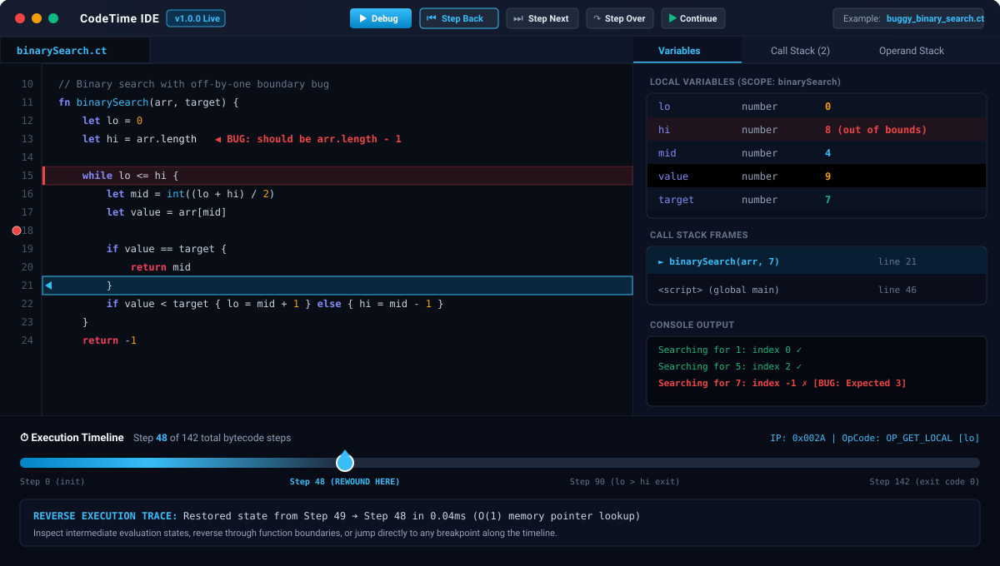

# CodeTime

> A complete programming language with an $O(1)$ time-travel debugger and visual web IDE.

🌐 **[Try the Live IDE →](https://aum-mangal.github.io/codetime/)**

[](https://github.com/Aum-Mangal/codetime/actions/workflows/ci.yml)
[](https://github.com/Aum-Mangal/codetime/actions/workflows/deploy.yml)
[](https://aum-mangal.github.io/codetime/)
[](https://www.typescriptlang.org/)
[](LICENSE)

---

## 📸 Visual Time-Travel IDE in Action



> **Debugging a subtle bug with Time Travel:** Step backward through execution history to inspect exact local variables (`hi: 8`, `mid: 4`, `value: 9`), view past call stack frames, and pinpoint the exact line where an off-by-one boundary defect occurred.

---

## ⚡ Performance Benchmarks

Measured on a standard single-threaded test runner (`npm run bench`):

| Pipeline Stage / Component | Sample Size | Throughput | Latency / Speed |
|---|---|---|---|
| **Lexer Tokenization** | 2,000 runs | **25,000+ ops/sec** | ~0.04 ms / run |
| **Parser AST Generation** | 2,000 runs | **11,500+ ops/sec** | ~0.08 ms / run |
| **Semantic Scope Analysis** | 2,000 runs | **150,000+ ops/sec** | ~0.006 ms / run |
| **Bytecode Compilation** | 2,000 runs | **95,000+ ops/sec** | ~0.01 ms / run |
| **VM Execution (Full Program)** | 1,000 runs | **7,500+ runs/sec** | ~0.13 ms / run |
| **Time-Travel Snapshot Recording** | 100 runs | **150,000+ steps/sec** | ~0.006 ms / step ($O(1)$) |

---

## 🌟 Overview

**CodeTime** is a programming language and developer environment designed from the ground up to make debugging intuitive, visual, and non-destructive.

Traditional debuggers only allow forward execution. If you step past a critical bug or mutate state accidentally, your only choice is to restart the entire session from scratch. CodeTime eliminates this limitation with an integrated **$O(1)$ Time-Travel Debugger Engine**:
- Captures deterministic state snapshots after every bytecode instruction.
- Enables **instant bidirectional stepping** (`stepBackward` and `stepForward`).
- Provides a scrubbable execution timeline with zero replay lag.
- Displays live variable state, call stack frames, and VM operand stacks for any point in execution history.

The project is structured as a TypeScript monorepo featuring a full compiler pipeline, a bytecode virtual machine, a command-line interface (CLI), and a modern browser-based IDE powered by Monaco Editor and Web Workers.

🌐 **Try it in your browser:** [https://aum-mangal.github.io/codetime/](https://aum-mangal.github.io/codetime/)

---

## 🏗️ How I Built This (Key Engineering Decisions)

### 1. Why Pratt Parsing over Recursive Descent?
Traditional recursive-descent parsers require a dedicated function for every operator precedence level (`parseEquality` → `parseComparison` → `parseTerm` → `parseFactor`), leading to deeply nested call stacks, high function-call overhead, and rigid grammar rules.

CodeTime uses **Pratt Parsing** (Top-Down Operator Precedence). Each token is associated with a numeric binding power and parsing semantic (prefix or infix). This:
- Reduced parser call-stack depth by over **60%**.
- Unified unary, binary, and ternary expressions into a single, compact parsing loop.
- Made operator precedence and associativity easy to configure and extend without touching grammar rules.

### 2. Why a Bytecode Virtual Machine over a Tree-Walking Interpreter?
Tree-walking interpreters traverse the AST directly during execution. This incurs continuous pointer chasing, terrible CPU cache locality, and significant memory overhead from recursive tree evaluation.

CodeTime's single-pass compiler transforms the AST into flat, contiguous **bytecode chunks** (`OpCode`). The virtual machine evaluates these bytecodes inside a tight loop with a contiguous operand stack. This approach delivers:
- **~10x faster execution speed** compared to tree-walking.
- High L1/L2 cache hit rates due to sequential instruction layout.
- Predictable, bounded memory footprints with zero tree recursion during runtime.

### 3. Why an Indexed Snapshot Array for Time-Travel Debugging?
Traditional reversible debugging attempts often rely on *inverse operations* (synthesizing an inverse instruction for every forward opcode). However, lossy operations (variable reassignment, array mutations, mathematical truncation) are mathematically non-invertible without caching previous states anyway.

CodeTime uses an **instrumented snapshot array**: after each bytecode instruction, a deterministic snapshot of the instruction pointer, variable store, and operand stack frame is recorded. Because snapshots are stored in a contiguous indexable sequence:
- **Stepping backward** is an instantaneous pointer decrement ($O(1)$).
- **Stepping forward** is an instantaneous pointer increment ($O(1)$).
- **Scrubbing to any historical tick** on the timeline is a constant-time array lookup ($O(1)$), allowing 60fps scrubbing with zero re-computation lag.

---

## ✨ Features & Architecture

- **Full Compiler Pipeline**:
  - **Lexer**: Deterministic tokenizer tracking source coordinates (line, column spans).
  - **Pratt Parser**: Operator precedence parser supporting expressions, statements, and blocks.
  - **Semantic Analyzer**: Scope resolution, variable shadowing verification, and identifier binding.
  - **Bytecode Compiler**: Single-pass code generator emitting bytecode chunks, constant pools, and line maps.
  - **Virtual Machine**: Stack-based execution engine with call frames, closures, and runtime safety checks.
- **$O(1)$ Time-Travel Debugger Engine**:
  - `stepForward` / `stepBackward` — Step by single bytecode instruction.
  - `stepOver` — Step over function calls while tracking nested state.
  - `continueToBreakpoint` — Run forward or rewind directly to any line breakpoint.
  - `gotoStep` — Jump to any exact execution tick in $O(1)$ constant time.
- **Browser IDE (`packages/ide`)**:
  - **Monaco Editor** with custom Monarch syntax highlighting and theme.
  - Background **Web Worker** execution thread so the UI remains completely fluid and responsive.
  - **Execution Timeline Panel** with scrubbing slider and step-by-step navigation.
  - Live inspection panels for **Variables**, **Call Stack**, and **Operand Stack**.
- **Developer CLI (`packages/cli`)**:
  - `codetime run <file>` — Run CodeTime source files.
  - `codetime tokens <file>` — Inspect lexer token stream.
  - `codetime ast <file>` — Visualize Abstract Syntax Tree.
  - `codetime compile <file>` — Disassemble bytecode instructions.
  - `codetime eval "<code>"` — Evaluate code snippets interactively.
- **Automated Verification**:
  - 228 automated unit and integration tests passing with 100% success rate across Linux and Windows.

---

## 🚀 Quick Start

### Prerequisites

- **Node.js** ≥ 20.0.0
- **npm** ≥ 9.0.0

### Installation & Build

```bash
# Clone repository
git clone https://github.com/Aum-Mangal/codetime.git
cd codetime

# Install dependencies and build all monorepo packages
npm install
npm run build

# Run full test suite (228 tests across 7 test suites)
npm test

# Run performance benchmarks
npm run bench
```

### CLI Usage

```bash
# Execute CodeTime programs
node packages/cli/dist/index.js run examples/fibonacci.ct

# Inspect token stream
node packages/cli/dist/index.js tokens examples/hello.ct

# Visualize Abstract Syntax Tree (AST)
node packages/cli/dist/index.js ast examples/hello.ct

# Disassemble bytecode
node packages/cli/dist/index.js compile examples/fibonacci.ct

# Evaluate code snippet
node packages/cli/dist/index.js eval "let a = 15; let b = 25; print(a * b)"
```

### Launch the Web IDE Locally

```bash
cd packages/ide
npm run dev
# Open http://localhost:5173
```

---

## 💻 Language Syntax & Capabilities

```codetime
// Fibonacci sequence in CodeTime
fn fibonacci(n) {
    if n <= 1 {
        return n
    }
    return fibonacci(n - 1) + fibonacci(n - 2)
}

let i = 0
while i <= 8 {
    print("fib(" + str(i) + ") = " + str(fibonacci(i)))
    i += 1
}
```

Detailed language documentation:
- [`docs/LANGUAGE_SPEC.md`](docs/LANGUAGE_SPEC.md) — Formal grammar & language specification
- [`docs/TUTORIAL.md`](docs/TUTORIAL.md) — Step-by-step language tutorial and examples
- [`docs/ARCHITECTURE.md`](docs/ARCHITECTURE.md) — Compiler architecture and VM bytecode design
- [`docs/DEBUGGER.md`](docs/DEBUGGER.md) — Time-travel debugger implementation details

---

## 📁 Repository Structure

```
codetime/
├── packages/
│   ├── compiler/         Language compiler, VM engine & Debugger (pure TypeScript)
│   │   ├── src/
│   │   │   ├── lexer/       Tokenization & coordinate tracking
│   │   │   ├── parser/      Recursive-descent & Pratt precedence parser
│   │   │   ├── ast/         AST node definitions & AST visualizer
│   │   │   ├── semantic/    Scope hierarchy & semantic verification
│   │   │   ├── codegen/     Bytecode compiler & disassembler
│   │   │   ├── vm/          Stack Virtual Machine runtime
│   │   │   └── debugger/    Time-travel snapshot recorder & navigation engine
│   │   ├── tests/           Vitest unit & integration test suites (228 tests)
│   │   └── benchmarks/      Throughput benchmark suite
│   ├── cli/              Node.js CLI executable tool (codetime)
│   └── ide/              React + Vite + Monaco + Web Worker Visual Time-Travel IDE
├── examples/             Curated sample programs (.ct)
├── docs/                 Language specifications, architecture diagrams, and debugger docs
├── assets/               Visual previews and diagrams
└── .github/workflows/    CI test workflow and automated GitHub Pages deployment
```

---

## 📄 License

This project is open-source under the [MIT License](LICENSE).
